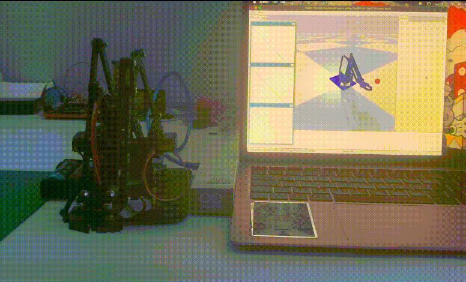
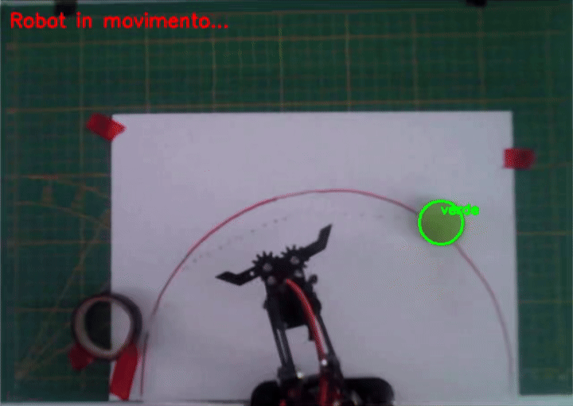
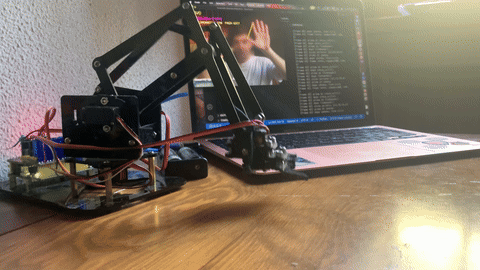
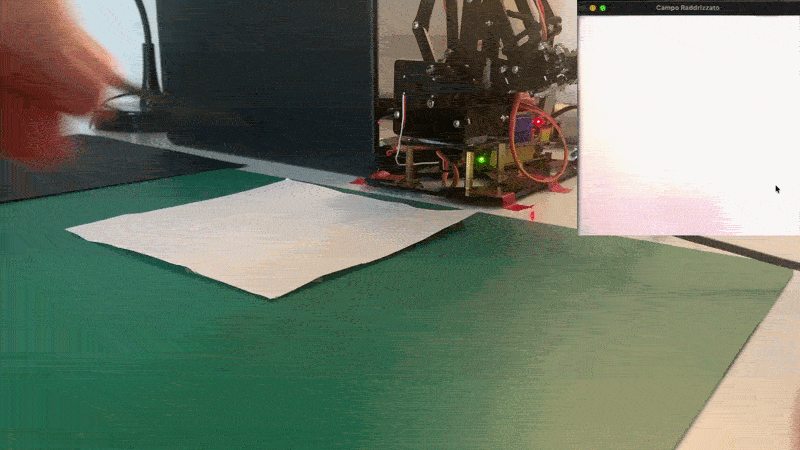

# LUCA FAGIOLI

**Building intelligent robotic systems**

---

## About Me

I'm interested in building robotic systems that combine **computer vision, motion control, simulation and machine learning**.

---

# Projects

<table>
<tr>
<td width="50%" valign="top">

### 🧠 Reinforcement Learning

PPO training in **PyBullet** for a simulated MeArm, with a workflow aimed at **sim-to-real deployment**.

`PyTorch` `Gymnasium` `PyBullet` `PPO`

**[→ Repository](https://github.com/lucaeffe03/MeArm-RL-PyBullet)**

</td>

<td width="50%" valign="top">

### 🎯 Pick & Place

Autonomous manipulation using **computer vision, calibration, homography and inverse kinematics**.

`OpenCV` `IK` `Arduino` `Serial/BLE`

**[→ Repository](https://github.com/lucaeffe03/Robot_Pick_Place)**

</td>
</tr>

<tr>
<td width="50%" valign="top">

### 👁️ Computer Vision & Hand Tracking

Real-time MeArm control using **MediaPipe hand tracking** and computer vision.

`Python` `OpenCV` `MediaPipe` `Arduino`

**[→ Repository](https://github.com/lucaeffe03/MeArm-computer-vision)**

</td>

<td width="50%" valign="top">

### 🎮 Robotic Tic-Tac-Toe

A physical Tic-Tac-Toe player combining **computer vision, Minimax and robotic manipulation**.

`OpenCV` `Minimax` `Arduino` `BLE`

**[→ Repository](https://github.com/lucaeffe03/MeArm_Tic_Tac_Toe)**

</td>
</tr>
</table>

---

## Connect

